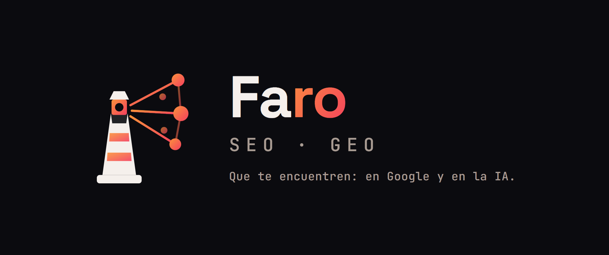

<p align="center">
  
</p>

<h3 align="center">Que te encuentren: en Google y en la IA.<br><em>Be found: on Google and by AI.</em></h3>

<p align="center">
  <a href="#-español">Español</a> · <a href="#-english">English</a> ·
   ·
   ·
  
</p>

---

## 🇪🇸 Español

### El problema
Hoy no basta con salir en Google. Cuando alguien le pregunta a **ChatGPT, Gemini o Perplexity**
por lo que tú haces, o **te citan… o citan a tu competencia.** La mayoría de las herramientas SEO
miden lo primero e ignoran lo segundo. Y casi ninguna te dice **exactamente qué arreglar** — te
dejan una lista de "recomendaciones" vagas.

### Qué hace Faro por ti
Un solo motor que **audita todo tu posicionamiento, te dice qué cambiar con datos reales, y mide
si la IA de verdad te cita.** Corres un comando y obtienes un informe claro y priorizado.

- ✅ **Sabes exactamente qué arreglar** — no consejos genéricos: hallazgos verificados sobre TU
  sitio, con la corrección concreta (título largo, falta schema, enlace roto, página huérfana…).
- 🔦 **Te hace presente en Google Y en la IA** — SEO clásico + **GEO**: optimiza para que los
  buscadores y los asistentes de IA te encuentren y **te citen**.
- 📊 **Mide la realidad, no adivina** — ¿ChatGPT/Gemini/Perplexity te citan cuando preguntan por tu
  nicho? Faro lo consulta y te dice **sí/no y quién te está ganando**.
- ⏱️ **Te ahorra horas** — un comando revisa lo que a mano te tomaría un día: técnica, contenido,
  velocidad, enlaces, schema, keywords, redes, YouTube, ficha local y datos reales de Search Console.
- 🗺️ **Estrategia, no solo diagnóstico** — agrupa tus keywords en *clusters* (tema pilar + hijos),
  mapea la intención y te dice **qué te falta cubrir** para ganar autoridad.
- 🔎 **Audita cualquier sitio** — el tuyo, el de un **cliente** o un **prospecto** — aunque no tengas
  su código: lo descarga solo (crawler educado, respeta robots.txt). Ideal para agencias y consultores.
- 🎯 **Una nota que entiendes en 5 segundos** — "Salud SEO" 0–100 con la tendencia (¿mejoré vs la
  vez pasada?).

### Todo lo que audita y optimiza (en una sola herramienta)
| Área | Qué te entrega |
|---|---|
| 🌐 **Tu sitio web** | Auditoría técnica, datos estructurados (schema), velocidad (Core Web Vitals), contenido delgado, enlaces rotos, enlazado interno, páginas huérfanas, redirecciones |
| 🔦 **GEO (citación por IA)** | Si ChatGPT/Gemini/Perplexity te citan en tu nicho + **qué dominios dominan** esas respuestas |
| 🔑 **Keywords + estrategia** | Expansión con IA, **clusters** temáticos (pilar → hijos), intención de búsqueda y **gaps** de contenido a crear |
| 📺 **Tu canal de YouTube** | Optimización de títulos, descripciones, capítulos, miniaturas y descripción del canal (2º buscador del mundo) |
| 📱 **Tus redes sociales** | Señales de perfil: bio con keyword + link, cadencia, coherencia de marca (Instagram hoy; más redes según su API lo permita) |
| 📍 **SEO local (Google Business Profile)** | Completitud de la ficha, categoría, **reseñas sin responder** y rendimiento (impresiones en Búsqueda/Maps, clics, llamadas, cómo-llegar) |
| 📢 **Menciones / reputación** | Vigila quién te nombra a ti, tu marca y tu competencia (Google Alerts) → oportunidades de enlace e ideas de contenido |
| 📈 **Tus datos reales** | Google Search Console (keywords, clics, posiciones), Google Analytics 4 (comportamiento), Google Trends (qué empieza a subir) |
| ⭐ **Salud SEO 0–100** | Una nota compuesta con tendencia + informe priorizado |

### Por qué confiar en Faro
- 🧱 **Determinista, no un LLM adivinando.** El 90% del análisis es código Python probado — resultados
  consistentes, no una "opinión" distinta cada vez.
- ✅ **Honesto.** Reporta solo lo que midió. Si un dato no está disponible, lo dice — nunca inventa
  métricas ni tendencias.
- 🔬 **Battle-tested.** El motor **corre a diario sobre un sitio real en producción** (no es una demo)
  y trae **110 tests que pasan**.

### Para quién es
Consultores SEO, agencias, y dueños de negocio o devs que quieren **rankear en Google y ser citados
por la IA** — sin pagar suites carísimas ni depender de recomendaciones humo.

### Empezar
```bash
git clone https://github.com/LeonardoIAConsult/faro-seo-geo.git
cd faro-seo-geo
python -m venv .venv && .venv\Scripts\activate      # Windows
pip install -r requirements.txt                     # o: -r requirements.lock (versiones fijas + hashes)

cp config.example.json faro.config.json             # los datos de TU sitio
cp .env.example .env                                # tus API keys (todas gratis)

python execution/report_build.py                    # informe completo
```
> Solo keys **gratis**: Search Console, PageSpeed, Analytics, Gemini. Opcionales de pago
> (OpenAI/Perplexity para más motores GEO) se activan poniendo su key.
> Para una instalación **reproducible y verificada** (a prueba de manipulación) usa
> `requirements.lock` (versiones fijas + hashes SHA-256; probado en Python 3.14).

### Licencia y precio
Gratis para uso **personal / evaluación**. Uso **comercial o de agencia** requiere licencia:
**US$99 (solo) · US$399 (agencia)**. Ver [LICENSE](LICENSE.md) · Compra/dudas: contacto@leonardoantolinez.com

---

## 🇬🇧 English

### The problem
Ranking on Google is no longer enough. When someone asks **ChatGPT, Gemini or Perplexity** about
what you do, either **they cite you… or they cite your competitor.** Most SEO tools measure the
first and ignore the second — and almost none tell you **exactly what to fix.**

### What Faro does for you
One engine that **audits your whole positioning, tells you what to change with real data, and
measures whether AI actually cites you.** Run one command, get a clear, prioritized report.

- ✅ **Know exactly what to fix** — verified findings on YOUR site with the concrete fix, not vague tips.
- 🔦 **Be found on Google AND by AI** — classic SEO + **GEO**: get found and **cited** by AI assistants.
- 📊 **Measure reality, don't guess** — do ChatGPT/Gemini/Perplexity cite you in your niche? Faro
  asks them and tells you **yes/no and who's beating you**.
- ⏱️ **Save hours** — one command audits what would take you a full day by hand.
- 🗺️ **Strategy, not just diagnosis** — groups your keywords into *clusters* (pillar + children),
  maps intent, and tells you **what's missing** to build authority.
- 🔎 **Audit any site** — yours, a **client's**, or a **prospect's** — even without their code:
  it crawls it for you (polite crawler, respects robots.txt). Built for agencies and consultants.
- 🎯 **A score you read in 5 seconds** — 0–100 "SEO Health" with trend.

### Everything it audits and optimizes (in one tool)
| Area | What you get |
|---|---|
| 🌐 **Your website** | Technical audit, structured data, Core Web Vitals, thin content, broken links, internal linking, orphan pages, redirects |
| 🔦 **GEO (AI citation)** | Whether ChatGPT/Gemini/Perplexity cite you + **which domains dominate** those answers |
| 🔑 **Keywords + strategy** | AI expansion, topic **clusters** (pillar → children), search intent and content **gaps** to create |
| 📺 **Your YouTube channel** | Titles, descriptions, chapters, thumbnails, channel copy (the world's 2nd search engine) |
| 📱 **Your social profiles** | Bio keyword + link, cadence, brand consistency (Instagram today; more networks as APIs allow) |
| 📍 **Local SEO (Google Business Profile)** | Profile completeness, category, **unanswered reviews** and performance (Search/Maps impressions, clicks, calls, directions) |
| 📢 **Mentions / reputation** | Track who names you, your brand and your competitors (Google Alerts) → link opportunities and content ideas |
| 📈 **Your real data** | Search Console (keywords, clicks, positions), Analytics 4 (behavior), Google Trends (what's rising) |
| ⭐ **SEO Health 0–100** | A composite score with trend + prioritized report |

### Why trust Faro
- 🧱 **Deterministic, not an LLM guessing** — 90% is tested Python: consistent results, not a new "opinion" each run.
- ✅ **Honest** — reports only what it measured. Never invents metrics or trends.
- 🔬 **Battle-tested** — runs **daily on a real production site** (not a demo), **110 tests passing**.

### Who it's for
SEO consultants, agencies, and business owners or devs who want to **rank on Google and get cited
by AI** — without paying for bloated suites or vague human "recommendations".

### Quickstart
```bash
git clone https://github.com/LeonardoIAConsult/faro-seo-geo.git
cd faro-seo-geo
python -m venv .venv && source .venv/bin/activate   # macOS/Linux
pip install -r requirements.txt                     # or: -r requirements.lock (pinned + hashes)

cp config.example.json faro.config.json             # your site's data
cp .env.example .env                                # your API keys (all free)

python execution/report_build.py                    # full report
```
> Only **free** keys: Search Console, PageSpeed, Analytics, Gemini. Optional paid engines
> (OpenAI/Perplexity for more GEO coverage) activate by adding their key.
> For a **reproducible, verified** (tamper-proof) install use `requirements.lock`
> (pinned versions + SHA-256 hashes; tested on Python 3.14).

### License & pricing
Free for **personal / evaluation** use. **Commercial or agency** use requires a license:
**US$99 (solo) · US$399 (agency)**. See [LICENSE](LICENSE.md) · Buy/questions: contacto@leonardoantolinez.com

---

<p align="center"><sub>Built by <a href="https://www.leonardoantolinez.com">Leonardo Antolinez</a> · Faro SEO·GEO · <em>Deterministic. Honest. Battle-tested.</em></sub></p>
